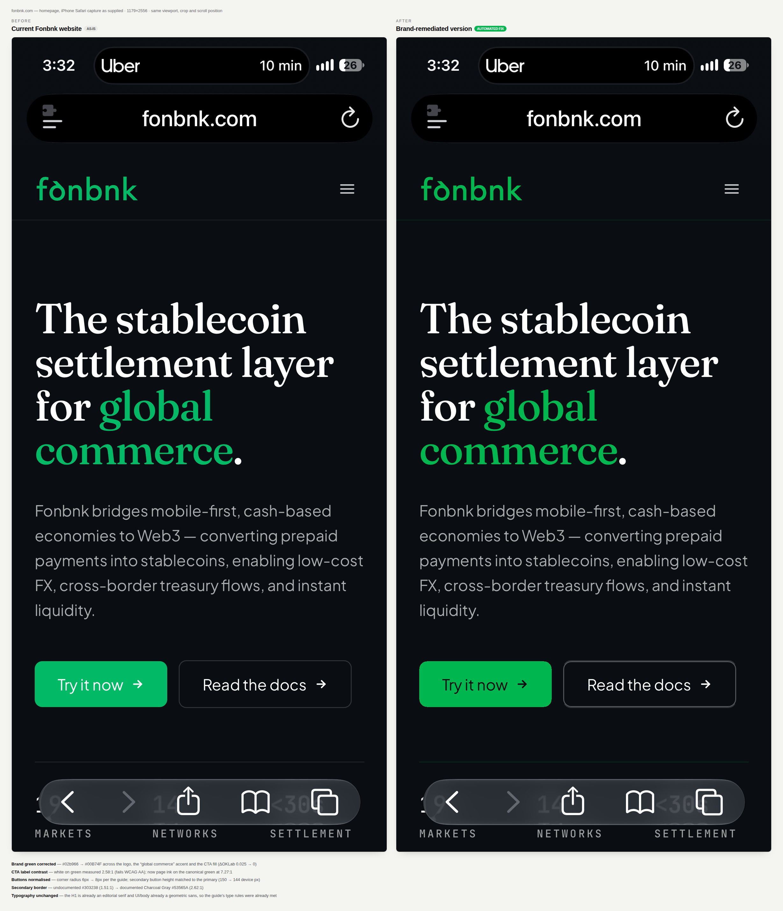

# Fonbnk homepage — brand remediation comparison



```bash
node --experimental-strip-types --import ./tests/register.mjs examples/fonbnk/build.ts
node --experimental-strip-types --import ./tests/register.mjs examples/fonbnk/compose.ts
```

The input was a screenshot (an iPhone Safari capture), not a live page, so the
corrections are applied to pixels rather than to a DOM. Every one is driven by a
measurement taken from the image and scoped to a colour value or a located
rectangle — never a global filter — so photography, third-party marks and the
phone's own browser UI are untouched. Both panels are the supplied 1179×2556
capture at the same crop and scroll position.

## What the audit found, and what was changed

| Signal | Before | After |
| --- | --- | --- |
| Brand green | `#02b966` everywhere | `#00B74F` (ΔOKLab 0.025 → 0) |
| CTA label on green | white, **2.58:1** — fails WCAG AA | page ink, **7.27:1** |
| Primary button radius | 20 device px (≈6 CSS px) | 24 device px (8 CSS px, per guide) |
| Button heights | primary 144, secondary 150 device px | both 144 |
| Secondary border | `#303238`, undocumented, 1.51:1 | Charcoal Gray `#53565A`, 2.62:1 |
| Body text | `#aaabac`, 8.41:1 | unchanged — already passes |
| Typography | editorial serif H1, geometric sans UI | unchanged — already compliant |

Two results are worth stating plainly because they argue *against* changing
things:

- **Typography needed no work.** The H1 is already an editorial serif and the
  UI/body already a geometric sans, which is what the identity guide asks for.
  A remediation that restyled them would have been inventing a problem.
- **The green was consistent — just consistently wrong.** One value, `#02b966`,
  is used for the logo, the "global commerce" accent and the CTA fill. A
  consistency-only audit would have scored this well; only the brand guide makes
  it a finding, which is the difference between a consistency audit and a
  compliance one.

The secondary border moves to the guide's documented neutral, which raises it
from 1.51:1 to 2.62:1 — better, but still short of the 3:1 that WCAG suggests
for UI component boundaries. Closing that gap needs a colour outside the
documented palette, so it is flagged rather than silently invented.

## Anti-aliasing

Recolouring a screenshot naively leaves a fringe of the old colour around every
glyph and curve. Each pixel is instead treated as a blend
`p = a·source + (1-a)·backdrop`; `a` is recovered by projection, and the pixel
is recomposed against the corrected colour. Pixels that sit too far off that
blend line are left alone, which is what keeps the body grey, the white headline
and the phone's UI out of the recolour.
